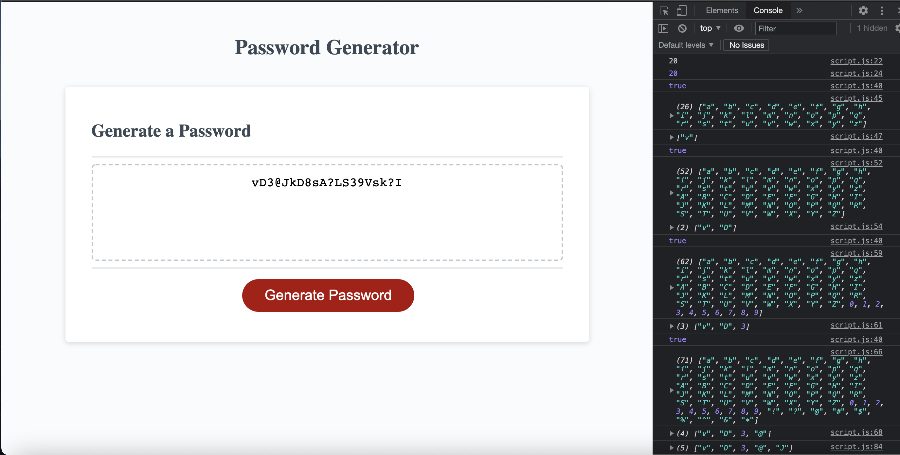
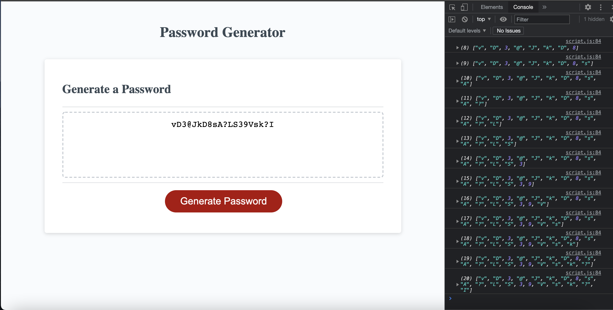
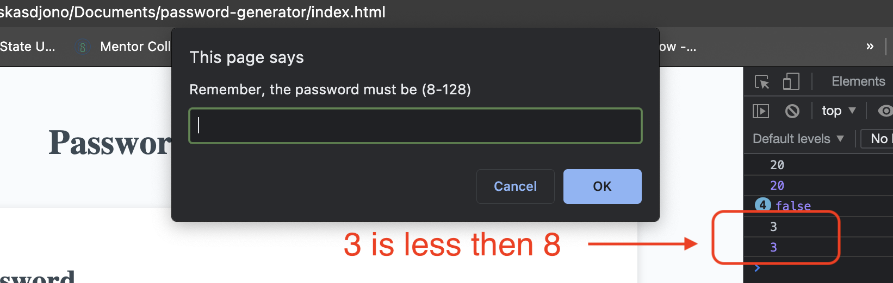
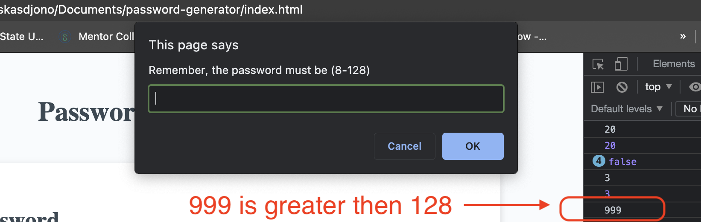
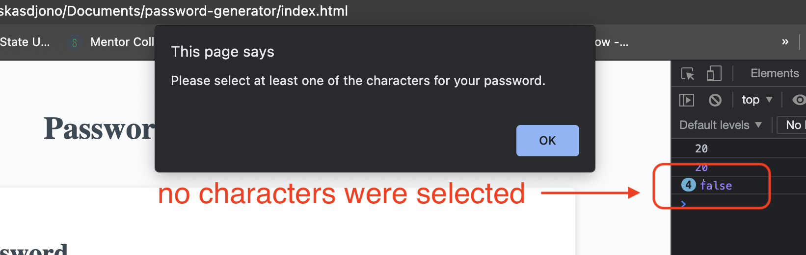

## Project Name : password-generator 
 
 

## Link to the working site
 

    - https://kasdjono.github.io/password-generator/
 

## This program will generate a random password based on user specifications
 
 

## The following features have been added to the page:
 

        - Propmts user to determine a password length
        - Verifies : password length >= 8 and password length <= 128 characters
        - Prompts user to select : upper case, lower case, numbers or special 
            characters to be included in the password
        - Verifies : at least one style of characters has been selected
        - Generates a randomly selected code within user specification
        - Displays the password in the "Generate a Password" container

 

## Screen Shots of Profile Page
 

 

